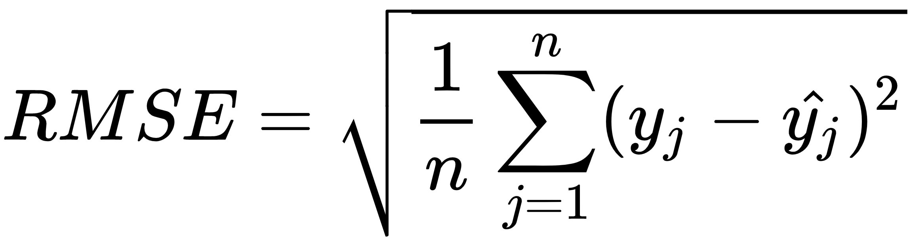

# **<div align="center">Watermark Remover With Deep Learning</div>**

Watermarks are needed to protect the copyrights of the photographs and figures and to protect their creators as well from all kinds of vulnerabilities such as reposting without credit. We think there was a clear need to create an ANN system that can recognize and remove watermarks. This project will be also considered as a white hat hacking research that will allow us to find the vulnerabilities in watermarking to eventually try and build a better copyright tool.

We will design a neural network that can remove watermarks from a given image with one. The idea is that a network would remove the watermark that corrupts and worsens the image without degrading the image quality. This should work regardless of what type of an image it is and irrelevant of the type of watermark. This project should allow for easy data acquisition since many different images will work. By downloading a variety of images without watermarks we will be able to have the desired output, then by developing a script that applies watermarks to an image we will be able to generate inputs into the network.
<br></br>
## **<div align="center">Training/testing set composition</div>**

For our project we required a large amount of image data. Fortunately we did not require any specific type of images. That made out process much simpler. We were able to find a great dataset of 100,000, since the content of the images was irrelevant this was a fairly easy step. After gathering the data we found some examples of commonly used watermarks and wrote a script that automatically applied those watermarks onto the images. Within that script we allowed for some randomization in the watermark rotation transparency and positioning, which theoretically should improve the models ability to generalize well within the scope of the problem.

In addition to that we will be using a subsample of the 100,000-image dataset. Since the computational resources required to train on the entire data set of such size far exceeds our capabilities. For our training and testing composition we will be using 5000 image subsample 80% of which will be allocated to training, 10% to testing and 10% to validation. We are using both validation and testing subsets in order to reduce overfitting as much as possible. 


You can see some of the examples in the image above. Another important preprocessing we completed was image resize and rescale. Since the images have to be put into the network with uniform size and each pixel value has to range from 0 to 1. The data we have collected and processed should be more than enough for our needs. It is also important to note we will be resizing the images to 448x448 in order to reduce the computational resources it will require us to train our network.
<br></br>

## **<div align="center">Internal Structure</div>**

After gathering the data we need for both the training and testing and building the watermark applier, we now have basically two different datasets (Original images and watermarked images) that we will be using to train our Generative Adversarial Network (GAN) and to initially try to build the Generator and Discriminator.

From some preliminary research, we found out that people have used the CNN network to design both the Generator and Discriminator. The generator part of the GAN learns to remove the watermarks in a specific image (input)  by incorporating feedback from the discriminator. It learns to make the discriminator classify its output as real. Generator training requires tighter integration between the generator and the discriminator than discriminator training requires. The portion of the GAN that trains the generator includes:
-	Image with watermark input
-	generator network, which transforms the random input into a data instance
-	discriminator network, which classifies the generated data
-	discriminator output
-	generator loss, which penalizes the generator for failing to fool the discriminator


The generator structure follows an autoencoder network structure. Essentially autoencoder has a double funnel structure which in the encoder part distils most important features of the image and funnels them through ever decreasing layers and the decoder is designed to reverse that process and our conjecture and hope is that within this process the noise within our image, i.e. watermark, will be “lost” and the output image will come out clean.


learning of the discriminator. The way we pretrained the generator is by setting up a denoising autoencoder. The autoencoder is given a watermarked image (the particulars of how the image is generated and how the convolutions work will be discussed later) and it produces an image which in return is compared to the original clean image. The loss of this function is computed by getting the root mean squared error of each pixel of the produced image compared to the original image.  This loss allows the network to minimize image distortion and at the same time reduce the noise, i.e. watermark within the image.



_<div align="center">Loss of the autoencoder</div>_

The given network can not truly be evaluated on its “Accuracy” as defined within Tensorflow, since this is not a classification problem. Instead we should monitor the decrease in its loss. We used “adam” optimizer. Experimenting with different optimizers did not yield any notable results. The table below represents the loss after 40 epochs of training each with different optimizers while holding all other hyperparameters separate.

|  Optimizer |Loss|
|---|---|
|Adam|0.04030|
|RMSprop|0.04032|
|SGD|0.04028|

While SGD has proved technically the lowest loss, we believe that the improvement is negligible and is within the margin of error. We think that Adam is superior for our problem. Further experimentation is needed to find the best hyperparameters, however considering the scope of the problem and the time it takes to train the network for a substantial number of epochs we decided to find improvements in our performance elsewhere, in more fundamental and structural parameter, as that would give us greater return on our time investment. 

```python
model = Sequential()

model.add(Conv2D(32, kernel_size=3, strides=2, input_shape=image_shape, 
                    padding="same"))
model.add(LeakyReLU(alpha=0.2))

model.add(Dropout(0.25))
model.add(Conv2D(64, kernel_size=3, strides=2, padding="same"))
model.add(ZeroPadding2D(padding=((0,1),(0,1))))
model.add(BatchNormalization(momentum=0.8))
model.add(LeakyReLU(alpha=0.2))

model.add(Dropout(0.25))
model.add(Conv2D(128, kernel_size=3, strides=2, padding="same"))
model.add(BatchNormalization(momentum=0.8))
model.add(LeakyReLU(alpha=0.2))

model.add(Dropout(0.25))
model.add(Conv2D(256, kernel_size=3, strides=1, padding="same"))
model.add(BatchNormalization(momentum=0.8))
model.add(LeakyReLU(alpha=0.2))

model.add(Dropout(0.25))
model.add(Conv2D(512, kernel_size=3, strides=1, padding="same"))
model.add(BatchNormalization(momentum=0.8))
model.add(LeakyReLU(alpha=0.2))

model.add(Dropout(0.25))
model.add(Flatten())
model.add(Dense(1, activation='sigmoid'))
```

Which is a basic CNN image classifier that takes as inputs the generated image and the original clean image. Eventually after training the discriminator will output positive values for clean images, and negative values for images with watermark residuals. The discriminator loss function will quantify how well the discriminator is able to distinguish clean images from images produced by the generator. It compares the discriminator's predictions on clean images to an array of 1s, and the discriminator's predictions on cleaned (generated) images to an array of 0s. Both of these arrays are the size of the generated image. Essentially we are applying binary cross entropy. If the discriminator is looking at a generated image at the moment it should output 0 and if it is looking at the clean original image it should output 1. This will allow us to collect the loss of the generator and the loss of the discriminator as will be explained later.

We define our generator as follows:

```python
self.encoder = tf.keras.Sequential([
    layers.Input(shape=(in_shp, in_shp, 3)),
    layers.Conv2D(256, (3,3), activation='relu', padding='same', strides=2),
    layers.Conv2D(128, (3,3), activation='relu', padding='same', strides=2),
    layers.Conv2D(64, (3,3), activation='relu', padding='same', strides=2),
    layers.Conv2D(32, (3,3), activation='relu', padding='same', strides=2),
    ])

self.decoder = tf.keras.Sequential([
    layers.Conv2DTranspose(32, kernel_size=3, strides=2, activation='relu', padding='same'),
    layers.Conv2DTranspose(64, kernel_size=3, strides=2, activation='relu', padding='same'),
    layers.Conv2DTranspose(128, kernel_size=3, strides=2, activation='relu', padding='same'),
    layers.Conv2DTranspose(256, kernel_size=3, strides=2, activation='relu', padding='same'),
    layers.Conv2D(3, kernel_size=(3,3), activation='sigmoid', padding='same')
    ])
```

As we mentioned above our generator network is a pre trained autoencoder network. As shown above, both the encoder and decoder have 4 different convolutional layers. The layers at the encoder try to detect and locate the watermarks that were applied on the image. The process by which it accomplishes this is what we would like to call feature compression and expansion. As you can see the structure of the encoder has a funnel shape. As the image is processed from one layer to another it is also compressed in size, i.e. outputs of each layer get progressively smaller. This allows the encoder network to extract most significant and desirable visual features from the image. As the encoder's capacity decreases it learns to disregard certain features and compress others. Which we theorize allows it to sub-segment the watermarks and pass that information onto the decoder network. The decoder will then do the work backwards by rebuilding the image to its initial state without having the watermark, by learning how to reconstruct the original image from the distilled output of the encoder our theory is that the decoder will eliminate the watermark from the image while maintaining original quality.

We then calculate the generator's loss which quantifies how well the image was cleaned and whether it could pass the discriminator check. If the generator is performing well, the discriminator will classify the generated images as clean (or 1). Here, we will compare the discriminators decisions on the generated images to an array of 1s. Both loss functions must be developed to allow the generator and discriminator to be trained in an adversarial way. Because these two neural networks are being trained independently they must be trained in two separate passes. This requires two separate loss functions and also two separate updates to the gradients. When the discriminator's gradients are applied to decrease the discriminator's loss, it is important that only the discriminator's weights are updated. It is not fair, nor will it produce good results, to adversarially damage the weights of the generator to help the discriminator. A simple backpropagation would do this. It would simultaneously affect the weights of both generator and discriminator to lower whatever loss it was assigned to lower. Thus having set up the full training pipeline we were able to train an efficient and powerful generator that allows us to remove watermarks and accomplish our goal.
<br></br>
## **<div align="center">Performance</div>**

After training the autoencoder for 40 epochs we were able to achieve some impressive results. On the left is the input into the autoencoder, while on the right is the image produced by the autoencoder.


As you can see such an autoencoder is capable of producing good results even without training in tandem with the discriminator. It is important to note that our ultimate goal is to maximize the performance of the generator, as such the discriminator network is ultimately disposable and serves as a tool to improve the generator output. Thus the fact that the autoencoder is already performing well is a good sign.

To further illustrate the process by which the generator produces images we will demonstrate intermediate outputs of each convolutional layer of the encoder. Given the following input into the autoencoder generator:


The intermediate layer outputs are as follows: (note each layer has much more outputs each, the most interesting elements were selected):


As you can see, the autoencoder performs as we expected. The encoder is able to separate the noise from the features, i.e. differentiate between the watermark and the objects within the image. Below you can see the output of the generator. You can see that the watermark is largely removed and the decoder was able to reconstruct the image with removing most of the watermark.


We also performed some experimentation with the size of the generator and different shapes of the filters. Important to note that as we increase the number of layers we are also forced to decrease the number of the filters in each consecutive layer in order to maintain the overall structure of the autoencoder. However any additional layers result in further compression of features and result in a decrease in performance. Further experimentation would allow us to find optimal parameters. Overall we have seen great performance with our generator after training for 40 epochs with Adam optimizer, we have achieved the loss of 0.0403 and we can clearly see some good results coming out of the generator network.

<br></br>
## **<div align="center">Ideas for improvement</div>**
There are several methods that could possibly improve our performance. Of course expanding the dataset subsample to more than 5000 images or even the entire dataset, would most likely improve the performance. This is true for most neural networks and we believe this would improve our network too. In addition to that we think designing a semantic segmentation model to separate and segment watermarks, thus generating a segmentation map that then could be passed in as additional input into the generator with the original marked image. We believe this would allow the generator network to focus on the watermarks and avoid general image quality reduction. In addition to that creating a more competent discriminator would allow for a better training loop for our generator.